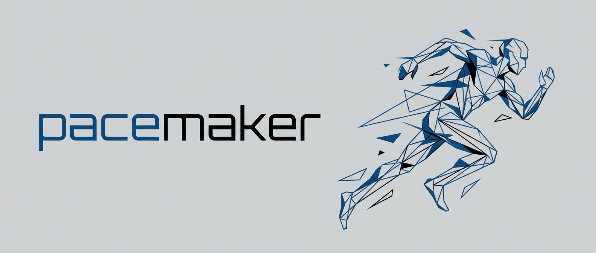

<p align="center">
  
</p>

<div align="center">

[](#)
[](#)
[](https://github.com/marcope-98/pacemaker/blob/master/LICENSE)
[](https://github.com/marcope-98/pacemaker/blob/master/CODE_OF_CONDUCT.md)

</div>

> COM automation for people with deadlines and a hatred of GUIs

`pacemaker` is a lightweight C++ wrapper around the ETAS INCA COM API. It lets you programmatically register the calibration parameters, set their values in real time, and control measurement recordings, without touching INCA's GUI.

# Building
## Building Source Code
The project is based on CMake. 

To start, clone the repository
```console
git clone https://github.com/marcope-98/pacemaker.git
cd pacemaker
```
> [!NOTE]
> Make sure an MSVC compiler is available on your system. For a portable alternative consider [PortableBuildTools by Data-Oriented-House](https://github.com/Data-Oriented-House/PortableBuildTools).

Create the build directory and run cmake by specifying the location of the `incacom.tlb` file available in your ETAS INCA installation folder.
```console
cmake -B build ^
      -S . ^
      -DINCACOM_TLB="..."
```
Finally compile the code
```console
cmake --build build --target pacemaker
```
## Generating Requirements Documents
The Software Requirements Specification (SRS) and Test Specification (TS) documents are written using LaTeX and are built using latexmk perl script from the MiKTeX Tex distribution.

> [!NOTE]
> For the MiKTeX installation instructions please visit the link [MiKTeX Download](https://miktex.org/download).
>
> For an easy to install perl environment for MS Windows please visit the link [Strawberry perl](https://strawberryperl.com/)

Once the dependencies are in place, and latexmk is installed via the MiKTeX package manager the SRS and TS documents can be generated via CMake.

In case of a portable version of MiKTeX you can supply the path via the `MIKTEX_BINARY_PATH` CMake variable.

Finally, enable building the documents by setting the variable `PACEMAKER_BUILD_REQUIREMENTS` to `ON`.

```console
cmake -B build ^
      -S . ^
      -DINCACOM_TLB="..." ^
      -DMIKTEX_BINARY_PATH="..." ^
      -DPACEMAKER_BUILD_REQUIREMENTS=ON
``` 

Then build the `requirements` target
```console
cmake --build build --target requirements
```

## Generating Source Documentation
The source documentation is generated automatically with Doxygen and Graphviz. Therefore a valid installation of both tool must be available.

If you have a portable version of these tools consider using the flags `DOXYGEN_EXECUTABLE` and/or `DOXYGEN_DOT_EXECUTABLE`.

Finally, enable building source code documentation by setting the variable `PACEMAKER_BUILD_DOCS` to `ON`
```console
cmake -B build ^
      -S . ^
      -DINCACOM_TLB="..." ^
      -DDOXYGEN_EXECUTABLE="..." ^
      -DDOXYGEN_DOT_EXECUTABLE="..." ^
      -DPACEMAKER_BUILD_DOCS=ON
```

And finally build the `docs` target
```console
cmake --build build --target docs
```

# Contributing
We welcome contributions from everyone in the community! To get started, please read our [CONTRIBUTING.md](https://github.com/marcope-98/pacemaker/blob/master/CONTRIBUTING.md) guide. Whether you're adding a new feature, improving documentation, or fixing a bug, your help and feedback are invaluable. 

# Authors
- Marco Peressutti - [@marcope-98](https://github.com/marcope-98) 
